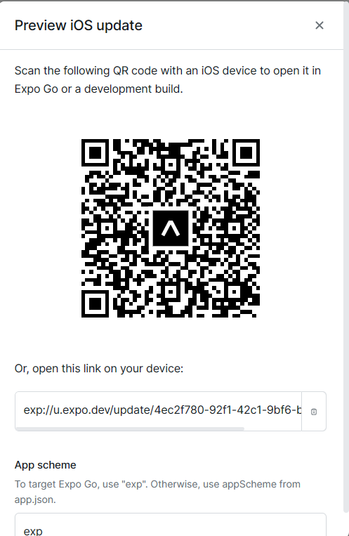

# Kitty Meow App

The Kitty Meow App is a simple React Native application that allows users to press a button and listen to the delightful sound of a kitty meowing. It's a fun and lighthearted app that brings a touch of joy to your day.

## Features

- Press the "Meow" button to hear a kitty meowing sound.
- The meow sound is randomly selected from a collection of adorable kitty meows.
- Enjoy a different meow every time you press the button, adding variety and surprise.

## Preview of the App

Scan the QR code or open the link in your device

### for iOS devices

Copy this [link](exp://u.expo.dev/update/4ec2f780-92f1-42c1-9bf6-b7bf3056dd7f): exp://u.expo.dev/update/4ec2f780-92f1-42c1-9bf6-b7bf3056dd7f

### for android devices

Copy this [link](exp://u.expo.dev/update/1f586a92-3c41-43a8-9231-ba91d715763a): exp://u.expo.dev/update/1f586a92-3c41-43a8-9231-ba91d715763a

## Installation

To use the Kitty Meow App, follow these steps:

1. Ensure that you have Node.js and npm (Node Package Manager) installed on your machine.
2. install Expo CLI globally by running 

> npm install -g expo-cli

3. Clone the repository or download the source code as a ZIP file. Run the following command to install the dependencies

> npm install

4. Open a terminal and navigate to the project directory.
5. Run the command npm install to install the required dependencies.
6. Connect your Android or iOS device to your computer or set up an emulator/simulator.
7. Run npx react-native run-android or npx react-native run-ios depending on your device platform.

## Usage

After installing and launching the Kitty Meow App, you will be presented with a simple screen containing a button labeled "Meow." To hear the kitty meowing, follow these steps:

1. Tap the "Meow" button on the screen.
2. You will hear a delightful kitty meowing sound.
3. Scroll refresh to see a different kitty meowing sound
4. Enjoy the adorable sounds of various kitties meowing!

## Customization

The Kitty Meow App comes with a default set of kitty meow sounds. However, you can customize the app by adding your own collection of meow sounds. To do this, follow these steps:

1. Locate the meowSounds directory in the project's source code.
2. Replace or add your own meow sound files (in WAV or MP3 format) to this directory.
3. Open the meowSounds.js file located in the project's source code.
4. Modify the meowSounds array to include the filenames of your meow sound files.
5. Save the file and run the app to hear your customized meow sounds.

## Contributing

If you'd like to contribute to the Kitty Meow App, you can follow these steps:

1. Fork the repository on GitHub.
2. Create a new branch with a descriptive name for your feature or bug fix.
3. Make your changes and additions in the new branch.
4. Test your changes thoroughly to ensure they work as expected.
5. Commit your changes and push the branch to your forked repository.
6. Open a pull request on the original repository, describing your changes in detail.
7. Please ensure that your contributions align with the project's coding conventions and follow good software development practices.

## License

The Kitty Meow App is licensed under the MIT License. You are free to modify and distribute this application for personal and commercial purposes.

## Acknowledgements

The Kitty Meow App was inspired by the joy and cuteness of kitties everywhere.
The React Native framework provided the foundation for developing this application.
Special thanks to the contributors and the open-source community for their valuable contributions and support.